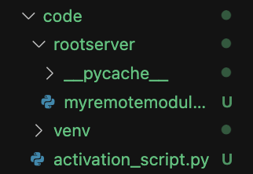
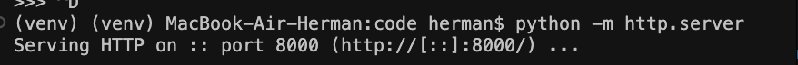
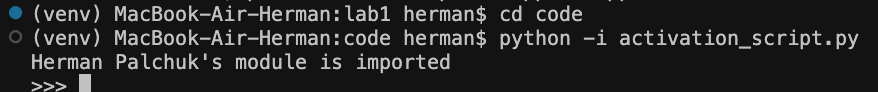

## Лабораторная работа #1
#### Пальчук Г.А. ИВТ 2.1

### Отчёт о проделанной работе

1. Директории с модулем и скриптом:

2. Запуск локального сервера с модулем:

3. Подключение к серверу и импорт (и исполнение функции) модуля:

4. Исполнение скрипта:
