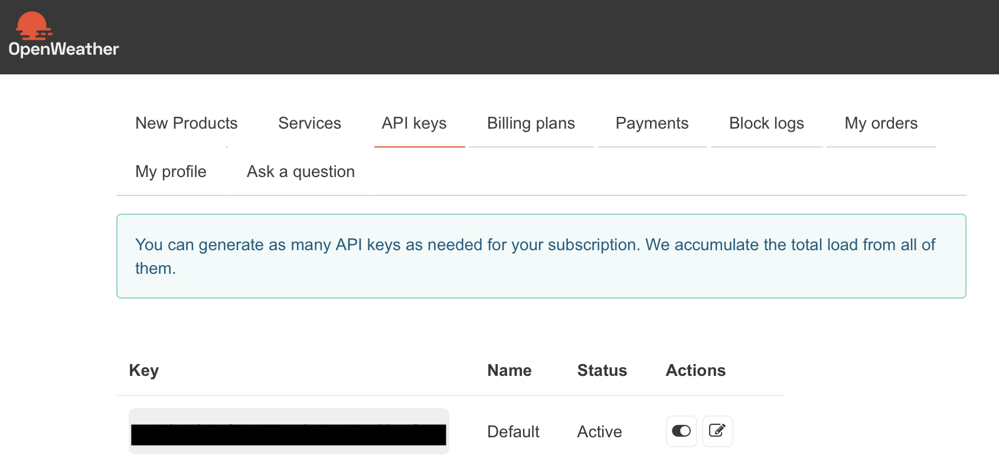
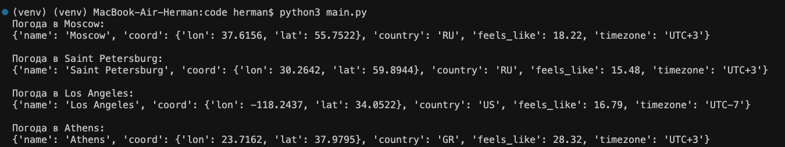
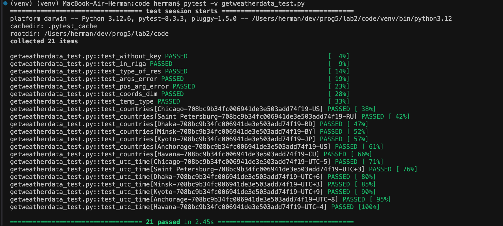

## Лабораторная работа #2
#### Пальчук Г.А. ИВТ 2.1

### Отчёт о проделанной работе

1. Получен ключ API


2. Выполнена первоначальная настройка:
- Создано и активировано окружение;
- Установлены необходимые библиотеки;
- Создан ```.env``` со значением ключа, ```.env``` указан в ```.gitignore```;

3. Доработан файл ```getweatherdata.py``` в соответствии с заданием:
>Функция должна возвращать объект в формате JSON, включающий:
>- информацию о названии города (в контексте openweathermap),
>- код страны (2 символа),
>- широту и долготу, на которой он находится,
>- его временной зоне,
>- а также о значении температуры (как она ощущается). Значение временной зоны выводить в формате UTC±N, где N - цифра временного сдвига.

4. Доработан файл ```main.py```:
- Использована библиотека ```requests``` вместо ```urllib```;
- Выбраны города 'Moscow', 'Saint Petersburg', 'Los Angeles', 'Athens';
- В результате выполнения программы получен ожидаемый результат.



5. Доработан файл ```getweatherdata_test.py```:
- Добавлены тесты для проверки корректности работы функции ```get_weather_data```;

