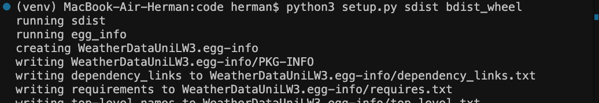
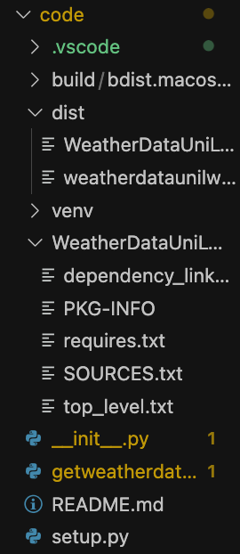

## Лабораторная работа #3
#### Пальчук Г.А. ИВТ 2.1

### Отчёт о проделанной работе

1. Установка нужных инструментов:

2. Копирование файла getweatherdata.py. Настройка файлов __init__.py и setup.py по шаблону.

3. Запуск команды:

  
  Получили новые папки:
  

4. Вводим API-Токен и выгружаем на сайт test.pypi.org:

4. Проверяем на сайте:

https://test.pypi.org/project/WeatherDataUniLW3/
