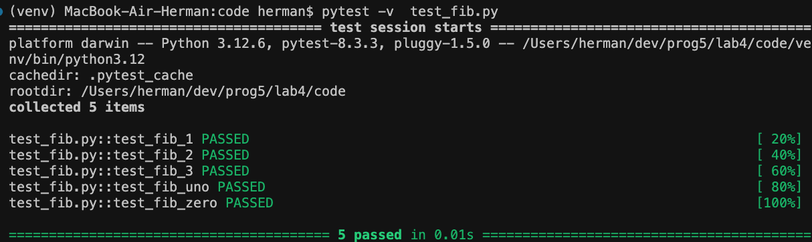

## Лабораторная работа #4
#### Пальчук Г.А. ИВТ 2.1

### Отчёт о проделанной работе

> Исходные файлы – ```even_numbers_iterator.py``` и ```gen_fib.py```
> 
> Рабочие файлы – ```main.py``` и ```test_fib.py```

### Задание 1
1. Реализована сопрограмма на основе кода файла ```gen_fib.py```;
2. Выполнена модификация программы;
3. Написаны тесты – файл ```test_fib.py```. Прописаны тесты для n кол-ва членов ряда + критические ситуации(0 и 1).



### Задание 2
1. Создан класс ```FibonacciLst```, который позволяет перебирать только элементы ряда Фибоначчи из переданного списка;
2. Реализованы методы: ```__iter__``` для инициализации итератора, и ```__next__``` для возврата следующего элемента ряда Фибоначчи, принадлежащего переданному списку;
3. Протестирован пример использования итератора на списке чисел.
