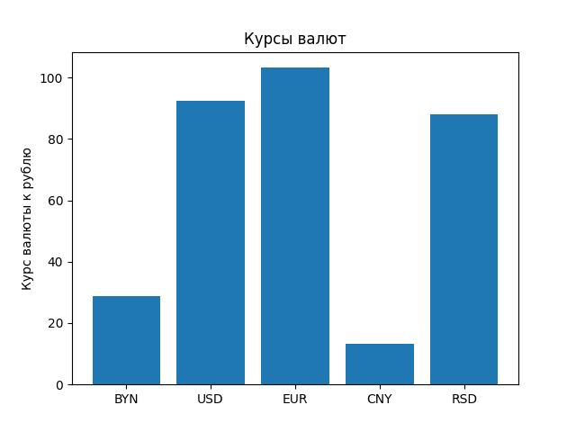
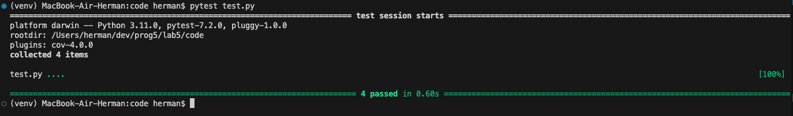

## Лабораторная работа #5
#### Пальчук Г.А. ИВТ 2.1

### Отчёт о проделанной работе

1. ***Выполнена первоначальная настройка:*** Создано и активировано окружение; установлены необходимые библиотеки.


2. ***Реализован паттерн проектирования Singleton для класса ```CurrencyManager```.***


3. ***Реализован ```CurrencyManager```:*** Определены атрибуты класса для хранения списка валют, времени последнего запроса и минимального интервала между запросами.
Реализованы методы для установки и получения минимального интервала.


4. ***Получение данных о валютах:*** Написан метод ```get_currencies``` для отправки запроса, извлечения данных о валютах и их преобразования в нужный формат. Для точного представления и обработки значений валют использована библиотека ```Decimal```. Причина выбора ```Decimal``` – отсутствие необходимости выполнять математические операции с полученными значениями.


5. ***Визуализация курсов валют:*** Создан метод ```visualize_currencies```, который строит график на основе полученных данных о валютах. Добавил timestamp в название файла для удобства.


---

### Обновление
6. ***Добавлены тесты***
    > **Тест на частоту запросов:**
    > Проверяется, что метод не выполняет запросы чаще, чем разрешено минимальным интервалом.
        
    > **Тест на визуализацию:**
    > Проверяется корректность вызова методов os.makedirs и plt.savefig, а также, что график сохраняется в правильную папку.
        
    > **Использование mock:**
    > В тестах для requests.get и других внешних зависимостей используются mock-объекты для предотвращения реальных запросов к серверу.
    
    Все тесты пройдены
    
    