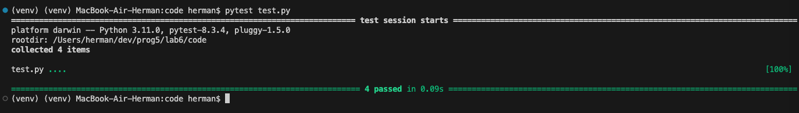

## Лабораторная работа #6
#### Пальчук Г.А. ИВТ 2.1

### Отчёт о проделанной работе

1. ***Выполнена первоначальная настройка:***

Создано и активировано окружение; установлены необходимые библиотеки.

2. ***Реализован паттерн проектирования "Декоратор":***

Создан абстрактный интерфейс `Component`, определяющий метод `fetch()`, который должен быть реализован в наследующих классах.
Реализован базовый декоратор `Decorator`, который принимает объект `Component` и делегирует вызов метода `fetch()` вложенному объекту.

3. ***Реализован класс CurrenciesList:***

Класс `CurrenciesList` реализует интерфейс `Component` и получает данные о валюте с сайта ЦБ. После получения данных с использованием requests и парсинга XML с помощью ElementTree, создается словарь с данными о валюте (код валюты, имя, значение и номинал).

4. ***Реализованы декораторы для вывода данных в различных форматах:***

**Декоратор JSON:** `DecoratorJSON` преобразует данные о валютах в формат JSON с отступами и корректным отображением кириллических символов.

**Декоратор CSV:** `DecoratorCSV` преобразует данные о валютах в формат CSV. Этот декоратор проверяет, что данные представлены в виде словаря, в случае ошибки - исключение.

5. ***Получение и вывод данных в различных форматах:***

Применены оба декоратора (DecoratorJSON и DecoratorCSV) к объекту `CurrenciesList` для вывода данных в формате JSON и CSV.

---

### Обновление
6. ***Добавлены тесты***

> **Тест на декоратор JSON и CSV:**
> Проверяется, что данные, полученные через декоратор JSON и CSV, преобразуются в строку в формате JSON и CSV с корректными значениями валют.

> **Тест на исключение при неправильном формате данных в CSV декораторе:**
> Проверяется, что при передаче неправильного формата данных в декоратор CSV -- исключение TypeError.

> Сохранена часть структуры из тестов прошлой Лабораторной Работы.

Все тесты пройдены
